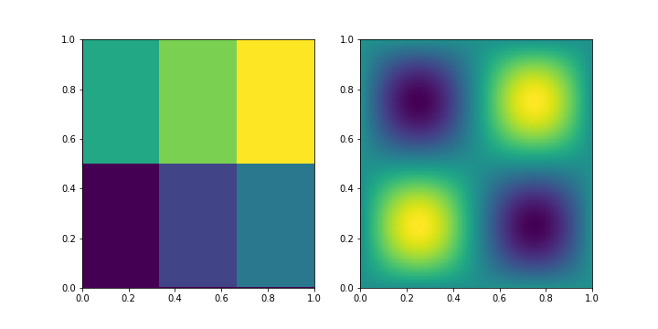

# Cedar

The Cedar Framework is a robust, variational multigrid library implementing
BoxMG on large scale parallel systems.

The Cedar Framework is a collaborative project between the University of
Illinois at Urbana-Champaign and Los Alamos National Laboratory.  Work on this
project is based in part upon work supported by the Department of Energy,
National Nuclear Security Administration, under Award Number DE-NA0002374.

TODO logo

Cedar is release under the BSD-3-Clause (see LICENSE.txt).

# Installation

```
mkdir build
cd build
ccmake ..
```

1. `[c]` to configure.  As a basic build, use
    - `CMAKE_INSTALL_PREFIX` as `./local_install/`
    - `MPI_LIBRARY` is set correctly

2. `[c]` to configure again
3. `[g]` to generate
4. `make` to compile (or `make -j4` to compile with 4 threads)
5. `make install` 

## CMAKE Options

| CMAKE Option           | Description            |
| --------------------   | ---------------------- |
| `ENABLE_3D`            | Build with 3D support  |
| `ENABLE_EXAMPLES`      | Build examples         |
| `ENABLE_MPI`           | Build with MPI support |
| `ENABLE_UNIT_TESTS`    | Build unit tests       |

# Examples

Following the installation instructions above, run the following from the build directory:
- `./examples/ser-poisson-2d` or
- `mpirun -np 4 ./examples/mpi-poisson-2d`

This should give:

<pre>
Iteration 0 relative l2 norm: 0.335225
Iteration 1 relative l2 norm: 0.0792311
Iteration 2 relative l2 norm: 0.0171261
Iteration 3 relative l2 norm: 0.00347607
Iteration 4 relative l2 norm: 0.000678134
Iteration 5 relative l2 norm: 0.000129261
Iteration 6 relative l2 norm: 2.4409e-05
Iteration 7 relative l2 norm: 4.6352e-06
Iteration 8 relative l2 norm: 9.01919e-07
Iteration 9 relative l2 norm: 1.83749e-07
Solution norm: 4.32708e-05
Finished Test
</pre>

The examples above are defined in `examples/2d/ser` and `examples/2d/mpi` of the root Cedar directory.

# Usage

- The `config.json` file lists the main configuration settings for the solver,
while `halo-config.json` identifies custom settings for the halo library.
- `src/config/schema.json` describes the full set of options.
- Adding `"log": ["status","error","info","debug"]` to the `config.json` file will give verbose output.

To view the solution, modify the `poisson.cc` file to include
```c
    int rank;
    MPI_Comm_rank(MPI_COMM_WORLD, &rank);

    std::ofstream outfile("solution-"+std::to_string(rank)+".txt");
    outfile << sol;
    outfile.close();
```

Then `make`.  Here there will be `np` different solution files `solution-*.txt`.  This can be viewed in Python for example in [example_output.ipynb](tools/example_output.ipynb), which gives the following for the processor layout (`mpirun -np 6`) and the solution:




# Citing

<pre>
@misc{cedar,
  author = {David Moulton and Luke N. Olson and Andrew Reisner},
  title = {Cedar Framework},
  year = {2017},
  url = {https://github.com/cedar-framework/cedar},
  note = {Version 0.1},
}
</pre>

# Getting Help

Create an [issue](https://github.com/cedar-framework/cedar/issues).
